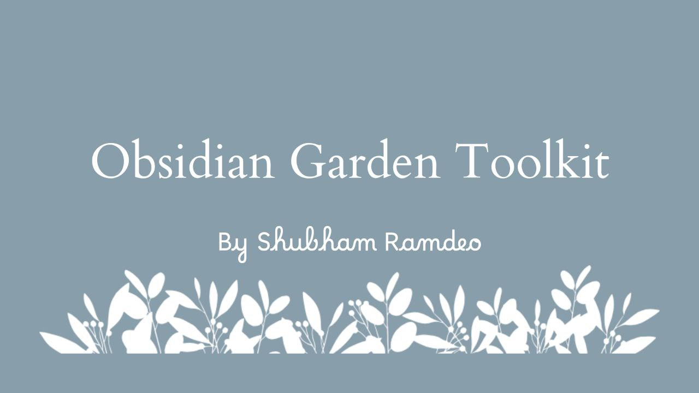

Welcome to **Obsidian Garden Toolkit** !

This is an obsidian vault which contains all the stuff you need to begin planting your digital garden! I have handpicked the theme, the plugins and configured the settings as I have found to be comfortable for many years of using obsidian every day. 

Hope you will enjoy it 😄

---

## Hotkeys

| Action                               | Hotkeys        |
| ------------------------------------ | -------------- |
| Daily notes: Open today's daily note | `ctrl + home`  |
| Focus on tab group to the left       | `ctrl + ←`     |
| Focus on tab group to the right      | `ctrl + →`     |
| Move line down                       | `alt + ↓`      |
| Move line up                         | `alt + ↑`      |
| Navigate back                        | `alt + ←`      |
| Navigate forward                     | `alt + →`      |
| Templates: Insert current date       | `ctrl + [`     |
| Templates: Insert current time       | `ctrl + ]`     |
| Templates: Insert template           | `ctrl + L`     |
| Cycle bullet/checkbox                | `ctrl + enter` |
| Toggle checkbox status               | `ctrl + enter` |
| Toggle pin                           | `ctrl + .`     |

---

## Powered by

This setup could not have been possible without the contributors of the following amazing plugins and the theme.

- Minimal Theme
- Advanced Tables
- Dataview
- Global Search and Replace
- Iconize
- Kanban
- Minimal Theme Settings
- Note Refactor
- Tag Wrangler
- and ofcourse Obsidian

You can know more about them in the `Community plugins` settings.

---

If you have questions related to obsidian, zettelkasten, second brain, gtd etc, you can ask me anything at [twitter](https://twitter.com/ramdeoshubham) 🐦 I will be happy to help you in your journey in productivity and knowledge management.

Yours fellow note maker

Shubham Ramdeo
